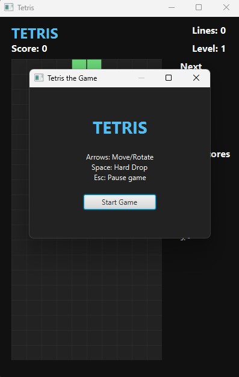
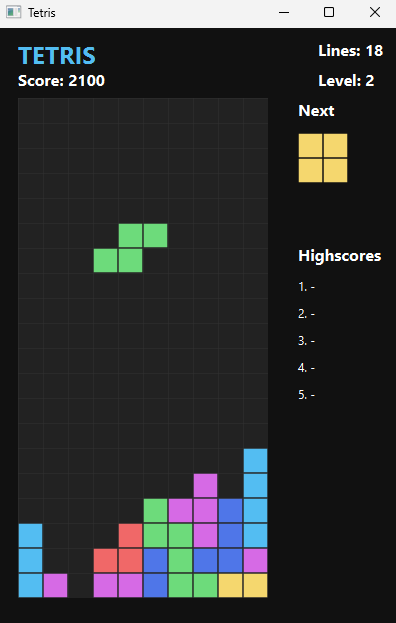

# Utveckling av Tetris i JavaFX

[](https://www.oracle.com/java/technologies/downloads/)
[](https://openjfx.io/)
[](LICENSE)

Detta projekt är ett examensarbete utvecklat inom ramen för utbildningen Fullstack Javautvecklare vid Grit Academy. Det är en fullt fungerande implementering av det klassiska spelet Tetris, byggt med Java 21 och JavaFX.

## 📸 Screenshots

<p align="center">
  
  
</p>

## 🚀 Funktioner

* **Realtidshantering:** Använder `AnimationTimer` för en mjuk spelupplevelse synkroniserad med skärmens uppdateringsfrekvens.
* **MVC-Arkitektur:** Strikt separation mellan affärslogik (`Model`), användargränssnitt (`View`) och kontroll-logik (`Controller`).
* **Självrättande logik:** Matrisbaserad rotationslogik som omedelbart korrigerar ogiltiga pjäspositioner vid kollision.
* **Progressivt system:** Dynamisk svårighetsgrad som ökar fallhastigheten var tionde rensad rad.
* **Hög testbarhet:** Kärnlogiken är byggd i rena Java-klasser, vilket möjliggör omfattande enhetstester med JUnit 5.

## 📄 Dokumentation
Den fullständiga tekniska rapporten som beskriver arkitektur, metodval och tekniska utmaningar finns tillgänglig här:
👉 [Examensrapport - Oliver Kalthoff (PDF)](docs/Examensarbete_Oliver_Kalthoff_Tetris_JavaFX.pdf)

## 🛠 Teknikstack

* **Språk:** Java 21
* **Grafik:** JavaFX 17 (FXML & CSS)
* **Byggverktyg:** Maven
* **Testning:** JUnit 5
* **Design:** Scene Builder (Gluon)

## 📋 Installation & Körning

### Förutsättningar
* Java 21 (JDK)
* Maven

### Steg-för-steg
1. Klona repot:
   ```bash
   git clone [https://github.com/olikal/Tetris.git](https://github.com/olikal/Tetris.git)
   ```
2. Navigera till mappen:
   ```bash
   cd Tetris
   ```
3. Bygg och kör projektet:
   ```bash
   mvn clean javafx:run
   ```
4. Tester
   För att verifiera applikationens stabilitet och logik, kör:
   ```bash
   mvn test
   ```
   Projektet använder bl.a. `@RepeatedTest` för att säkerställa att rotationslogiken är robust över hundratals slumpmässiga scenarier.

## 🏗 Struktur

* `se.gritacademy.tetris` - Innehåller projektets samtliga klasser, inklusive:
    * `GameBoard`, `Tetromino` & `GameStats` (Domänlogik)
    * `TetrisGame` (Spelmotor och AnimationTimer)
    * `TetrisController`(GUI-hantering)
* `resources/` - Innehåller FXML för spelets grafiska layout.

---
© 2026 Oliver Kalthoff - Grit Academy
